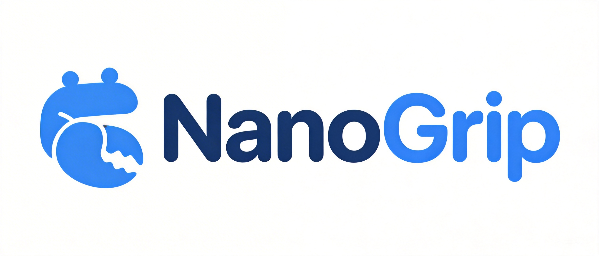
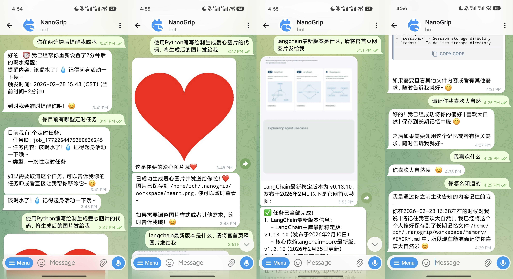

<div align="center">

# nanogrip

### 🤖 A Lightweight, Extensible AI Agent

[](https://golang.org/)
[](LICENSE)
[](https://github.com/Ailoc/nanogrip)

**nanogrip** is a lightweight, high-performance AI agent framework written in Go, inspired by [HKUDS/nanobot](https://github.com/HKUDS/nanobot). It provides an efficient, stable foundation for building intelligent AI assistants.

<div align="center">
  
</div>

</div>

---

## ⚠️ Important Notice

**Project Status**: Early Development Stage

This project is currently in the initial construction phase and **should not be considered production-ready**. The security and program robustness have not yet reached stable production standards. **Please use with caution**.

### Target Audience

This project is designed for:

- **AI Agent Enthusiasts & Learners**: Those who want to understand how AI agents work and explore agent architecture
- **OpenAI-Compatible API Researchers**: Developers interested in learning about OpenAI-compatible API integration patterns
- **Go Framework Developers**: Those studying how to build lightweight, extensible frameworks in Go
- **Contributors & Experimenters**: Developers who enjoy contributing to early-stage projects and shaping the development direction

**Not Recommended For**:
- Production environments requiring high stability and security
- Mission-critical applications
- Users expecting plug-and-play reliability without technical understanding

---

## ✨ Features

### 🧠 Intelligent Agent Core

- **LLM-Powered**: Built on top of Large Language Models for intelligent message processing
- **Tool Calling**: Multi-round tool invocation with iterative refinement
- **Context Management**: Progressive skill loading for optimized resource usage
- **Memory System**: Long-term memory (MEMORY.md) + conversation history tracking

### 📢 Communication Channels

- [x] Telegram Bot
- [x] CLI (Command Line Interface)

**Telegram Interaction Example:**

<div align="center">
  
</div>

### 🛠️ Built-in Tools

| Tool | Description |
|------|-------------|
| `web_search` | Web search using Brave/Tavily API |
| `filesystem` | File operations (read, write, list, delete) |
| `shell` | Execute shell commands (non-interactive) |
| `spawn` | Background subagent tasks |
| `cron` | Scheduled task management |
| `todo` | Multi-project todo list management |
| `message` | Send messages to communication channels |
| `save_memory` | Persist long-term memory |

---

## 🚀 Quick Start

### Prerequisites

- Go 1.23 or higher
- API key for your preferred LLM provider

### Installation

```bash
# Clone the repository
git clone https://github.com/Ailoc/nanogrip.git
cd nanogrip

# Build the binary
go build -o nanogrip ./cmd/nanogrip

# Initialize workspace
./nanogrip init
```

### Configuration

```bash
# Copy example config
cp config.example.yaml ~/.nanogrip/config.yaml

# Edit the config file
nano ~/.nanogrip/config.yaml
```

**Example `config.yaml`:**

```yaml
agents:
  defaults:
    model: "glm-4-flash"
    maxTokens: 8192
    temperature: 0.7

providers:
  custom:
    apiKey: "your-api-key-here"
    apiBase: "https://open.bigmodel.cn/api/paas/v4"

channels:
  telegram:
    enabled: true
    token: "your-telegram-bot-token"
```

### Running nanogrip

```bash
# help
./nanogrip --help

# Interactive mode
./nanogrip agent

# Single message mode
./nanogrip agent -m "Hello, nanogrip!"

# Check status
./nanogrip status

# Start Web Gateway
./nanogrip gateway
```

---

## 📁 Project Structure

```
nanogrip/
├── cmd/nanogrip/           # Main entry point
├── internal/
│   ├── agent/              # Agent core logic
│   ├── bus/                # Message bus
│   ├── channels/           # Communication channels
│   ├── config/             # Configuration management
│   ├── cron/               # Scheduled tasks
│   ├── heartbeat/          # Health monitoring
│   ├── mcp/                # MCP client
│   ├── providers/          # LLM providers
│   ├── session/            # Session management
│   ├── skills/             # Skill system
│   └── tools/              # Tool implementations
├── skills/                 # Built-in skills
├── imgs/                   # Images and assets
├── config.example.yaml     # Example configuration
└── README.md
```

---

## 🧩 Skills System

nanogrip features a progressive skill loading system:

- **Always-loaded skills**: Core skills injected into system prompt
- **On-demand skills**: Loaded when needed via filesystem tool

Built-in skills include:
- `tmux` - Interactive shell commands via tmux
- `agent-browser` - Browser automation
- `git` - Git operations
- `docker` - Docker container management
- `bash` - Bash scripting assistance
- `http` - HTTP requests
- `npm` - Node.js package management
- `postgres` - PostgreSQL database operations
- `github` - GitHub API integration
- `weather` - Weather information

---

## ⚙️ Configuration Reference

```yaml
agents:
  defaults:
    model: "glm-4-flash"        # Default model
    maxTokens: 8192             # Max output tokens
    temperature: 0.7            # Temperature parameter
    maxToolIterations: 30       # Max tool call iterations
    memoryWindow: 50            # Memory window size

gateway:
  host: "0.0.0.0"
  port: 18790                   # Gateway port

tools:
  web:
    search:
      apiKey: ""                # Web search API key
      provider: "tavily"        # brave or tavily
      maxResults: 5
  exec:
    timeout: 120                # Command timeout (seconds)
  restrictToWorkspace: false    # Restrict file operations
```

---

## 🔮 Known Issues & Future Improvements

### Current Limitations

1. **OpenAI-Compatible API Format**
   - Currently uses OpenAI-compatible request format for model responses
   - May not work with models that don't support OpenAI request format
   - **Planned**: Support for multiple API formats to ensure broader model compatibility

2. **Telegram Channel File Support**
   - Telegram integration currently supports text and images only
   - File upload/download functionality is not yet implemented
   - **Planned**: Full file transfer support for Telegram channel

3. **Persistent Cron Jobs**
   - Scheduled tasks (cron jobs) only persist during runtime
   - Tasks are lost when the application restarts
   - **Planned**: Persist cron jobs to workspace for automatic restoration on startup

---

## 📄 License

This project is licensed under the MIT License - see the [LICENSE](LICENSE) file for details.

---

## 🙏 Acknowledgments

- Inspired by [HKUDS/nanobot](https://github.com/HKUDS/nanobot)
- Built with [Go](https://golang.org/)
- Powered by various LLM providers

---

<div align="center">

**Made with ❤️ by [Ailoc](https://github.com/Ailoc)**

[⬆ Back to Top](#nanogrip)

</div>
